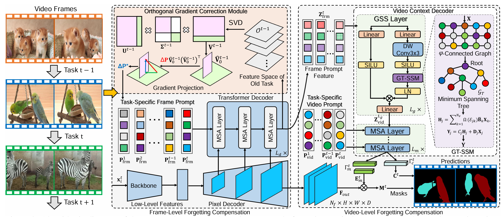
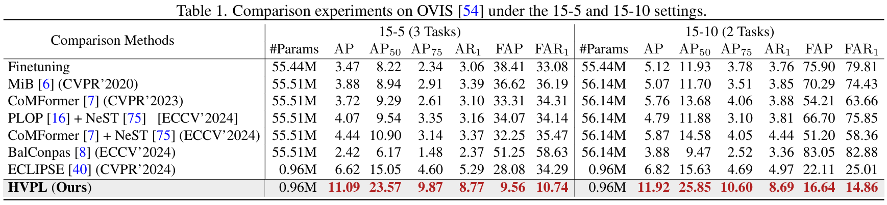
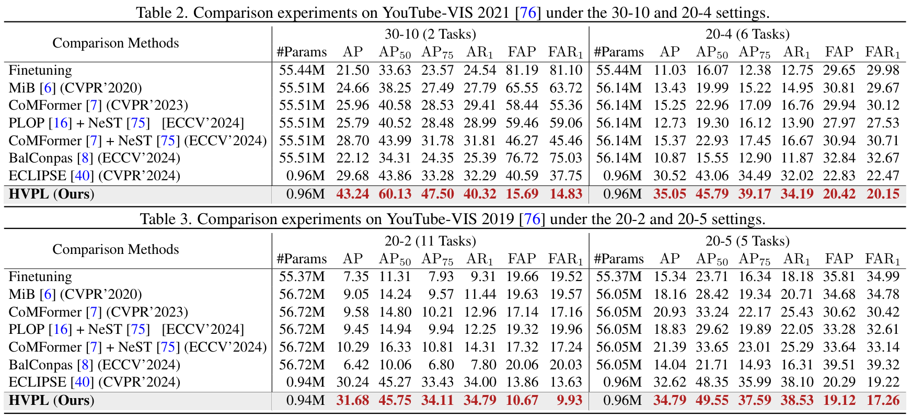

# Hierarchical Visual Prompt Learning for Continual Video Instance Segmentation (ICCV 2025)


[Jiahua Dong](https://scholar.google.com/citations?hl=zh-CN&user=xrXqa8AAAAAJ)<sup>\*</sup>, Hui Yin<sup>\*</sup>, Wenqi Liang, Hanbin Zhao, Henghui Ding, Nicu Sebe, Salman Khan, Fahad Shahbaz Khan
<br>
<sup>\*</sup> Equal contribution

[](https://openaccess.thecvf.com/content/ICCV2025/html/Dong_Hierarchical_Visual_Prompt_Learning_for_Continual_Video_Instance_Segmentation_ICCV_2025_paper.html)
[](https://arxiv.org/abs/2508.08612)

<div align="center">
  
</div><br/>

## Introduction
Video instance segmentation (VIS) has gained significant attention for its capability in segmenting and tracking object instances across video frames. However, most of the existing VIS methods unrealistically assume that the categories of object instances remain fixed over time. Moreover, they experience catastrophic forgetting of old classes when required to continuously learn object instances belonging to new classes. To address the above challenges, we develop a novel Hierarchical Visual Prompt Learning (HVPL) model, which alleviates catastrophic forgetting of old classes from both frame-level and video-level perspectives. Specifically, to mitigate forgetting at the frame level, we devise a task-specific frame prompt and an orthogonal gradient correction (OGC) module. The OGC module helps the frame prompt encode task-specific global instance information for new classes in each individual frame by projecting its gradients onto the orthogonal feature space of old classes. Furthermore, to address forgetting at the video level, we design a task-specific video prompt and a video context decoder. This decoder first embeds structural inter-class relationships across frames into the frame prompt features, and then propagates task-specific global video contexts from the frame prompt features to the video prompt. The effectiveness of our HVPL model is demonstrated through extensive experiments, in which it outperforms baseline methods.

##   Updates
* **`Aug 21, 2025`:** 🎉🎉🎉 Code and pretrained weights are now available! Thanks for your patience :)
* **`Jun 26, 2025`:** 🎉🎉🎉 HVPL is accepted to ICCV 2025! 


## Installation

See [installation instructions](INSTALL.md).

## Getting Started

We provide a script `train_net_hvpl.py`, that is made to train all the configs provided in HVPL.

To train a model with "train_net_hvpl.py" on VIS, first
setup the corresponding datasets following
[Preparing Datasets for HVPL](./datasets/README.md).

## Train 

All training scripts are located in the `scripts/` directory.


|       Scenario        |           Script            |  
|:---------------------:|:---------------------------:| 
| YouTubeVIS 2019 20-2  | `bash youtube_2019_20_2.sh` | 
| YouTubeVIS 2019 20-5  | `bash youtube_2019_20_5.sh` | 
|                       |                             | 
| YouTubeVIS 2021 20-4  |  `bash yvis_2021_20_4.sh`   |  
| YouTubeVIS 2021 30-10 |  `bash yvis_2021_30_10.sh`  | 
|                       |                             | 
|       OVIS 15-5       |     `bash OVIS_15_5.sh`     |  
|      OVIS 15-10       |    `bash OVIS_15_10.sh`     |  

## Eval
Note that during training, testing will be performed, generating a corresponding `result.json` file as well as a `.txt` file for saving the evaluation metrics (AP, AP<sub>50</sub>, AP<sub>75</sub>, AR<sub>1</sub>).

To compute the forgetting (F) metric (FAP, FAR<sub>1</sub>):

1. **Organize results**: Rename each `result.json` to `result_X.json` (X = step index, 0 to N)
2. **Place files**: Move renamed files to the directory specified in `dataset_eval.py` (`resFile_dir`)
3. **Update ground truth**: Set `annFile` in `dataset_eval.py` to your test split path
4. **Run evaluation**:

```bash
python dataset_eval.py
```

<div align="center">


<br />
<br />


</div>

## <a name="CitingHVPL"></a>Citing HVPL

If you use HVPL in your research or wish to refer to the baseline results published in the Model Zoo, please use the following BibTeX entry.

```BibTeX
@InProceedings{Dong2025HVPL,
  author    = {Dong, Jiahua and Yin, Hui and Liang, Wenqi and Zhao, Hanbin and Ding, Henghui and Sebe, Nicu and Khan, Salman and Khan, Fahad Shahbaz},
  title     = {Hierarchical Visual Prompt Learning for Continual Video Instance Segmentation},
  booktitle = {Proceedings of the IEEE/CVF International Conference on Computer Vision (ICCV)},
  month     = {October},
  year      = {2025}
}
```

## Acknowledgement

Our code is largely based on [VITA](https://github.com/sukjunhwang/VITA), [ECLIPSE](https://github.com/clovaai/ECLIPSE), [Detectron2](https://github.com/facebookresearch/detectron2), [Mask2Former](https://github.com/facebookresearch/MaskFormer), and [Deformable DETR](https://github.com/fundamentalvision/Deformable-DETR). We are truly grateful for their excellent work.

